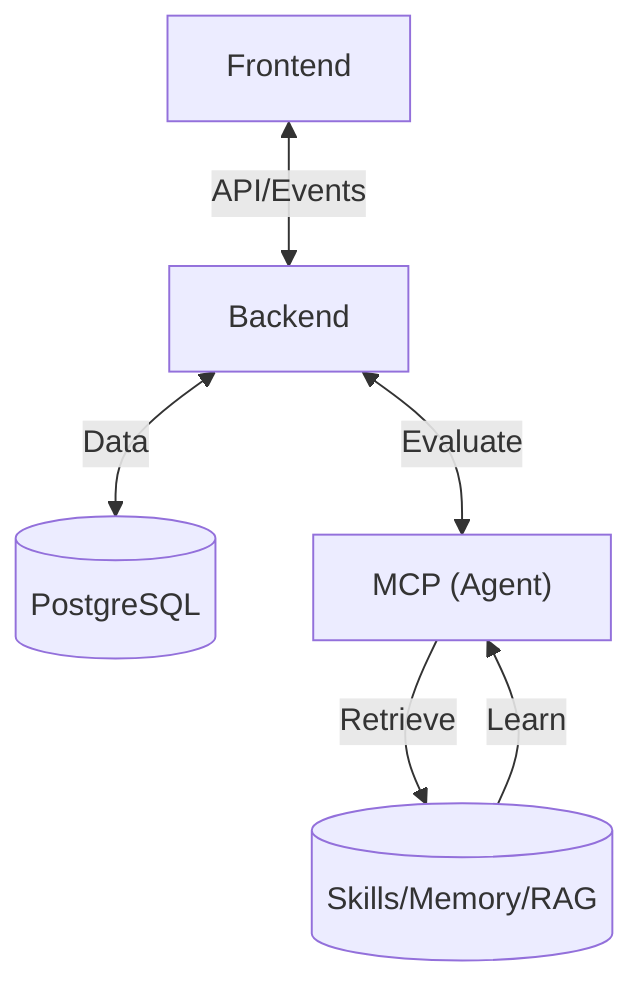

# AGENTS.md — 乳腺癌副作用评估系统

> 本文件是项目导航入口（给 AI Agent 和开发者看的目录页）。详细契约见各目录 `spec.md`，模块约束见各目录 `AGENTS.md`。
> 遵循 Harness Engineering "地图而非手册" 原则：~50 行入口，指向更深层文档。

## 定位

患者描述副作用 → LLM 提取症状 → 规则引擎分级 → 风险等级 + 处置建议。

## 技术栈与架构

| 层 | 选型 | 职能边界 |
|----|------|----------|
| **Frontend** | React 18 + Tailwind | 用户交互、视觉展示、埋点上报 |
| **Backend** | FastAPI + PostgreSQL | 业务编排、持久化、审计中控 |
| **MCP** | Hermes Agents | 意图识别、症状评估、知识进化 |

## 导航

| 路径 | 说明 |
|------|------|
| **开发契约** | |
| `backend/spec.md` | API、服务层、数据模型、风险规则 |
| `frontend/spec.md` | 页面、组件、类型、事件触发 |
| `mcp/spec.md` | 工具接口、输入输出 Schema |
| **模块约束** | |
| `backend/AGENTS.md` | Backend 架构约束与验证管道 |
| `frontend/AGENTS.md` | Frontend 技术约束与验证管道 |
| `mcp/AGENTS.md` | MCP 无状态约束与验证管道 |
| **项目文档** | |
| `.env` | API Key 配置 |
| `assignment.docx` | 项目详细需求文档 |

## 全局约束 🚫

1. **环境先行** — 运行代码前必须 `source .venv/bin/activate`，使用 `uv` 管理包与运行脚本
2. **TDD 强制** — Test driven development。红绿测试，先写编写测试，测试不通过为红，再编写最少代码达到绿禁止反过来。
3. **Spec 编写原则** — 严格遵循，先讨论，得到确认后再更新spec，并开启下一个点的讨论。未得到明确答复，严谨修改spec以及开启后续的讨论。
4. **Spec 同步** — 每次代码变更，都要查询相关 spec 是否过期或冲突，必须同步更新该模块的 `spec.md`
5. **语言简洁** — 更新编写spec时，应保证文档简洁有力，不要写例如，弃用XX方案，修改了XX等临状态。只写入与当前状态相关的描述。
6. **禁止跳过失败测试** — 不准 `skip` 或删测试绕过
