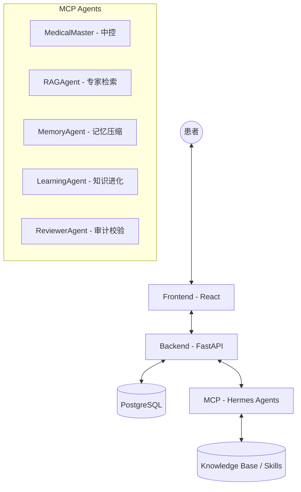

# 乳腺癌副作用评估系统 (Breast Cancer Side Effect Assessment System)

[](https://opensource.org/licenses/MIT)

本项目是一个基于大模型（LLM）的乳腺癌副作用评估系统，旨在帮助患者识别、分级副作用并提供专业的处置建议。

## 🏗 设计架构

本项目遵循 **Harness Engineering "地图而非手册"** 的设计思想，架构参考 **Hermes Agent 架构**，实现了从感知到决策再到知识进化的闭环。



---

## 🤖 MCP (Hermes Agents)

MCP 层是系统的核心大脑，采用多 Agent 协作模式（Hermes Pattern），实现症状提取、风险评估与自我进化。

### 核心 Agent 职责
- **MedicalMaster (中控)**: 系统的指挥中心。负责意图识别、协调其他 Agent 资源，并根据 Skills 库进行副作用风险分级。
- **RAGAgent (专家)**: 对接权威医学指南库，为评估提供循证支持，确保建议的科学性。
- **MemoryAgent (记忆)**: 负责会话的“脱水记录”。将长对话压缩为结构化记忆（JSON），提取核心症状线索。
- **LearningAgent (进化)**: 系统自学习的核心。扫描未学习的记忆，自动提取新的评估逻辑或症状，更新原子技能库（Skills）。
- **ReviewerAgent (审计)**: 确保系统进化的稳定性。对 `LearningAgent` 产出的新知识进行冲突检测与格式校验。

### 知识进化流程
1. **评估**: MedicalMaster 评估用户症状。
2. **记录**: MemoryAgent 将评估记录存入 `learned: false` 的记忆包。
3. **学习**: LearningAgent 提取评估逻辑。
4. **校验**: ReviewerAgent 审核后正式将新技能合入 `SKILL.md`。

---

## 🖥 Backend (FastAPI)

后端充当业务编排器与持久化中枢。

- **业务中控**: 处理前端请求，路由至对应的 MCP 接口。
- **持久化**: 使用 PostgreSQL 存储用户信息、历史记录与评估报告。
- **异步任务**: 处理知识学习（Learning）等耗时操作。

---

## 🎨 Frontend (React + Tailwind)

提供极致的用户体验与响应式设计。

- **智能交互**: 类对话式 UI，支持多轮症状追问。
- **可视化**: 根据风险等级（HIGH/MEDIUM/LOW）展示不同的视觉反馈（红/黄/绿）。
- **响应式**: 适配移动端与 PC 端，确保患者在任何环境下都能快速访问。

---

## 🛠 开发指南

### 环境配置
本项目使用 `uv` 进行包管理：

```bash
# 激活虚拟环境
source .venv/bin/activate

# 安装依赖
uv sync
```

### 运行项目
- **Backend/MCP**: `uv run uvicorn ...` (详见 [backend/spec.md](backend/spec.md))
- **Frontend**: `npm run dev`

### 核心原则
1. **TDD 强制**: 必须先编写测试（红），再编写代码（绿）。
2. **Spec 同步**: 任何代码变更必须同步更新对应的 `spec.md`。
3. **简洁有力**: 保持代码与文档的极简主义。

---

> 更多细节请参考 [AGENTS.md](AGENTS.md) 导航页。