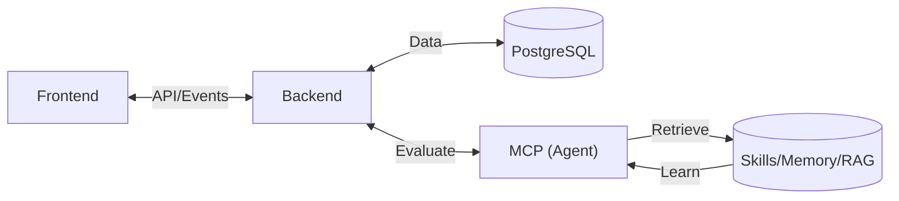
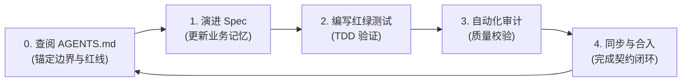
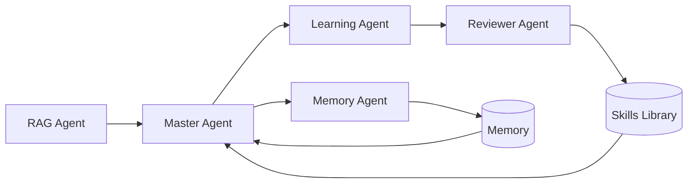

# 乳腺癌副作用评估系统 (Breast Cancer Side Effect Assessment System)

[](https://opensource.org/licenses/MIT)

本项目是一个基于大模型（LLM）的乳腺癌副作用评估系统，旨在帮助患者识别、分级副作用并提供专业的处置建议。

## 🏗 设计架构

本项目遵循 **Harness Engineering** 的设计思想，架构参考 **Hermes Agent 架构**，实现了从感知到决策再到知识进化的闭环。



---

## Harness 工程开发实践

本项目基于 **Harness (评估/进化支架)** 工程思想，构建了一个结构化的开发与进化闭环。Harness 不仅仅是运行时的支架，更是开发过程中的“防误操作”与“持续增强”引擎。

### 1. 闭环迭代开发流程 (The Closed-Loop Cycle)
项目的开发并非盲目的编码过程，而是严格约束在由 **AGENTS.md (导航地图)** 与 **spec.md (业务契约)** 驱动的 Harness 循环之中：



- **导航与约束 (The Soul)**：开发任何功能前必先查阅对应模块的 `AGENTS.md`。它作为项目的“灵魂导航”，锁定了模块间的职能边界与全局红线，确保开发者的每一行逻辑都不偏离既定的架构轨道。
- **契约演进 (The Memory)**：`spec.md` 承载了项目的所有业务细节与技术契约。开发过程严格遵循 spec 展开；若在实现中发现逻辑断层，必须同步回溯并修补 spec。它是系统进化的“数字化记忆”，确保持续迭代过程中的每一处变更有据可考。
- **红绿测试 (The Guard)**：坚持 TDD 强制原则。通过先编写基于 `spec.md` 的失败测试（红灯），再实现功能逻辑以通过测试（绿灯），将 AI 的产出精准锚定在契约定义的“安全航道”内，彻底消除模型产出的随机性。


### 2. 分层开发思路与契约索引
项目开发遵循“职能解耦、契约先行”的原则，各层级开发思路如下：

- **🖥 Backend (业务编排)**：关注业务流程的幂等性与数据持久化。作为中枢，协调前端请求与智能决策引擎，并管理后台异步任务（如知识自进化流水线）。
- **🎨 Frontend (交互呈现)**：关注 UI 状态机的严谨性与响应式体验。通过事件驱动机制，将复杂的医学评估结果转化为直观的视觉引导与交互操作。
- **🤖 MCP (逻辑进化)**：关注评估逻辑的原子化与自学习能力。实现从原始症状到分级建议的转化，确保所有决策依据均可追溯。

#### 📚 项目开发索引
| 模块 | 导航地图 (Map) | 开发契约 (Contract) |
| :--- | :--- | :--- |
| **Backend** | [backend/AGENTS.md](backend/AGENTS.md) | [backend/spec.md](backend/spec.md) |
| **Frontend** | [frontend/AGENTS.md](frontend/AGENTS.md) | [frontend/spec.md](frontend/spec.md) |
| **MCP** | [mcp/AGENTS.md](mcp/AGENTS.md) | [mcp/spec.md](mcp/spec.md) |
| **Global** | [AGENTS.md](AGENTS.md) | [SKILL.md](mcp/agents/skills/SKILL.md) |

---

## 🤖 MCP (详见 [mcp/spec.md](mcp/spec.md))

MCP 层是系统的核心大脑，采用多 Agent 协作模式（Hermes Pattern），实现症状提取、风险评估与自我进化。



- **MasterAgent (中控)**: 系统的指挥中心。负责意图识别、协调其他 Agent 资源，并根据 Skills 库进行副作用风险分级。
- **RAGAgent (专家)**: 医学知识库库，为评估提供循证支持，确保建议的科学性。
- **MemoryAgent (记忆)**: 负责会话的“脱水记录”。将长对话压缩为结构化记忆（JSON），提取核心症状线索。
- **LearningAgent (进化)**: 系统自学习的核心。扫描未学习的记忆，自动提取新的评估逻辑或症状，更新技能库（Skills）。
- **ReviewerAgent (审计)**: 确保系统进化的稳定性。对 `LearningAgent` 产出的新知识进行冲突检测与格式校验。

### 主Agent运行逻辑

MasterAgent 遵循 **Orchestrator (编排者)** 模式，其核心运行逻辑如下：

1. **意图识别与追问**：
   - 优先判断患者描述是否充分。
   - **双轮上限**：若信息不足，发起追问（`question`），追问需简洁（<50字），且最多仅允许进行两次追问。
   - 追问达到上限后，若信息仍不全，则基于现有信息给出初步评估或就医引导。

2. **资源调度优先级**：
   - 遵循 **Skills (技能库) > Memory (历史记忆) > RAG (指南知识库)** 的检索顺序，确保评估的权威性与一致性。

3. **输出协议**：
   - 严格执行 JSON 协议，通过 `type` 字段区分 `evaluation`（评估结果）与 `question`（交互追问），确保系统的高内控性。


### 知识进化流程
1. **评估**: MasterAgent 评估用户症状。
2. **记录**: MemoryAgent 将评估记录存入标记为 `learned: false` 的记忆包。
3. **学习**: LearningAgent 提取评估逻辑。
4. **校验**: ReviewerAgent 审核后正式将新技能合入 `SKILL.md`。

---

## 🖥 Backend (详见 [backend/spec.md](backend/spec.md))

后端充当业务编排器与持久化中枢。

- **业务中控**: 处理前端请求，路由至对应的 MCP 接口。
- **持久化**: 使用 PostgreSQL 存储用户信息，历史记录，评估报告以及全量的对话历史。
- **异步任务**: 处理记忆压缩（Memory）和学习（Learning）这类耗时操作。

---

## 🎨 Frontend (详见 [frontend/spec.md](frontend/spec.md))

提供极致的用户体验与响应式设计。

- **智能交互**: 类对话式 UI，支持多轮对话。
- **可视化**: 根据风险等级（HIGH/MEDIUM/LOW）展示不同的视觉反馈（红/黄/绿）。

---

## 🛠 开发指南

### 环境配置
本项目使用 `uv` 进行包管理：

```bash
# 激活虚拟环境
source .venv/bin/activate

# 安装依赖
uv sync
```

### 运行项目

```bash
# 运行 MCP
export PYTHONPATH=$PYTHONPATH:.
uv run python mcp/server.py

# 运行backend
uv run uvicorn backend.app.main:app --host 127.0.0.1 --port 8000 --reload

#运行前端
cd frontend
npm install && npm run dev
```
