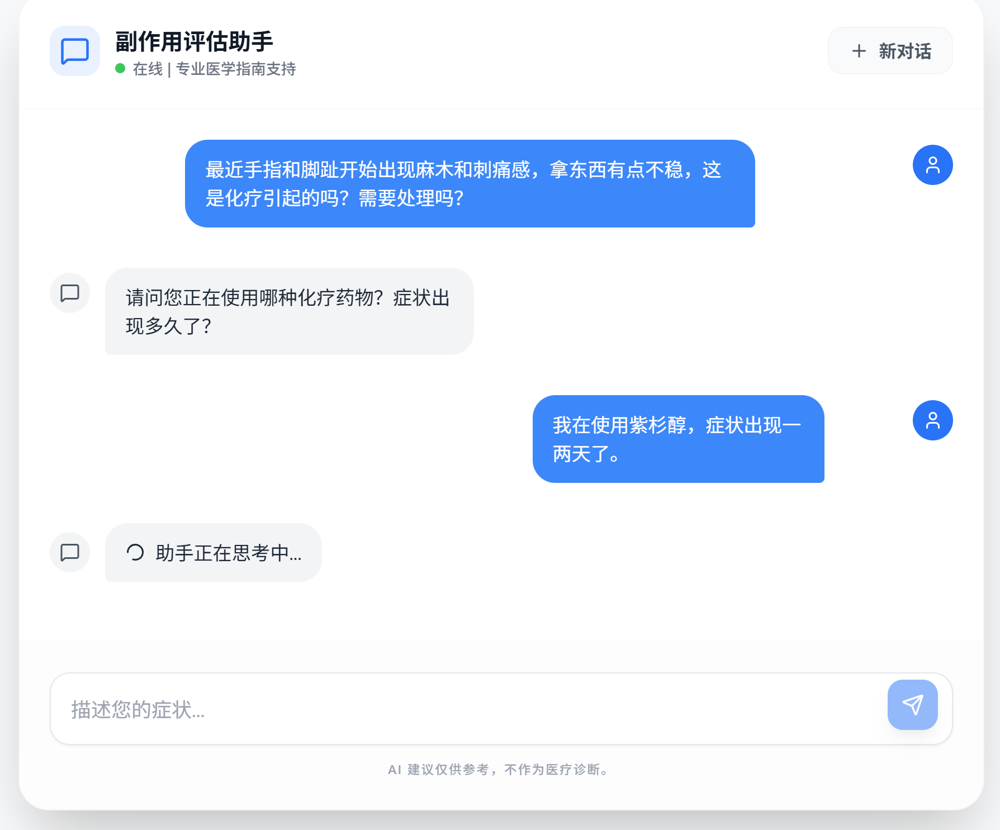

# Agent 运行机制演示

## 场景一：首次无状态提问（耗时约 30s）

由于是初次提问，Agent 需要进行完整的意图识别、知识检索与综合评估，因此响应时间相对较长。


### 后端调用日志

```bash
02:53:42 [INFO] [REQUEST] Received evaluate request for session session_t6o3hygn6br | {"session_id": "session_t6o3hygn6br"}
2026-05-03 02:53:42,137 - base.py - 780 - INFO - ALL tokens: 52, Available tokens: 57269
02:53:47 [INFO] [RAG_QUERY] Querying Guidelines: 化疗后头痛剧烈 视力模糊 一侧手脚无力 | {"query": "化疗后头痛剧烈 视力模糊 一侧手脚无力"}
02:53:48 [INFO] [RAG_QUERY] Found 3 relevant items | {"query": "化疗后头痛剧烈 视力模糊 一侧手脚无力", "results_count": 3}
```

### 会话结束与短期记忆生成

当单次评估结束后，系统会自动提取评估结果的核心要点，并将其持久化为该会话的专属记忆文件。

`mcp/agents/memory/session_t6o3hygn6br/2026-05-03_02-54-15.json`

```json
{
  "learned": false,
  "created_at": "2026-05-03T02:54:15.176012",
  "title": "[剧烈头痛伴单侧肢体无力] - [化疗后] - [立即急诊就医]",
  "summary": "患者化疗后突发剧烈头痛、视力模糊及单侧肢体无力，高度提示急性脑血管事件，属危及生命的高风险紧急情况，需立即拨打120或前往急诊就医。",
  "assessment": {
    "id": null,
    "session_id": "session_t6o3hygn6br",
    "user_input": "化疗后我突然感到头痛剧烈、视力模糊，一侧手脚无力，这正常吗？",
    "risk_level": "HIGH",
    "action_required": "立即线下就医",
    "ctcae_grade": "Grade 1",
    "advice": "这是高风险紧急情况，请立即拨打急救电话或前往急诊。化疗期间突发剧烈头痛、视力模糊伴一侧肢体无力，高度提示急性脑血管事件（如缺血性卒中或脑出血）。化疗药物（如顺铂、甲氨蝶呤等）及肿瘤本身均可增加血栓或出血风险。请勿自行服药或等待观察，任何延误都可能导致永久性神经功能损伤甚至危及生命。",
    "evidence": "患者主诉化疗后突发剧烈头痛、视力模糊、单侧肢体无力，符合急性脑血管事件的典型临床表现，属于CTCAE v5.0中神经系统不良事件的高风险紧急情况。",
    "matched_rule_id": "QA-H-001",
    "display_text": "您描述的剧烈头痛、视力模糊和一侧手脚无力，是急性脑血管事件（如中风）的典型表现，属于危及生命的紧急情况。请立即停止一切活动，拨打120急救电话或让家人送您前往最近医院的急诊科。",
    "contact_team": true,
    "version": "v1.0.0",
    "learned": false,
    "created_at": "2026-05-03T02:54:02.038302"
  }
}
```
## 场景二：基于会话记忆的二次提问（耗时约 10s）

当针对同一会话再次提问时，Agent 会优先读取并复用上下文记忆。此过程省去了重复的深度检索与基础评估步骤，使得响应速度大幅提升。


### 后端调用日志

```bash
2026-05-03 03:14:54,486 - base.py - 780 - INFO - ALL tokens: 41, Available tokens: 57108
03:14:58 [INFO] [MEMORY_READ] Reading memory: session_t6o3hygn6br/2026-05-03_02-54-15 | {"session_id": "session_t6o3hygn6br", "timestamp": "2026-05-03_02-54-15", "path": "/home/ubuntu/shenzhi/mcp/agents/memory/session_t6o3hygn6br/2026-05-03_02-54-15.json"}
```

### Agent 自主追问机制

当患者提供的信息不够充分时，Agent 会依据内置的医疗评估准则主动发起追问，以收集完整的临床评估条件。



## 场景三：Agent 自进化与技能（Skill）学习

```bash
.
└── chemotherapy-side-effect-triage
    ├── SKILL.md
    ├── chest-pain-dyspnea.md
    ├── fever.md
    └── petechiae-purpura.md
```

### 自动生成的 `SKILL.md` 多级索引结构

```markdown
# 化疗副作用分诊技能手册

## 概述
本技能用于对化疗患者出现的副作用进行快速分诊和风险评估，帮助患者判断是否需要紧急就医、预约门诊或居家观察。

## 分诊流程
1. **症状识别**：根据患者描述的症状，匹配对应的副作用模块。
2. **风险评估**：结合化疗药物类型、症状严重程度、伴随症状进行风险分级。
3. **处置建议**：给出明确的行动指引（立即就医/预约门诊/居家观察）。
4. **CTCAE分级**：参照不良事件通用术语标准进行分级。

## 症状模块索引

| 症状 | 资源文件 | 典型风险等级 |
|------|----------|-------------|
| 发热伴寒战（化疗期间） | [发热评估](./fever.md) | HIGH |
| 胸闷气喘（蒽环类化疗后） | [心脏毒性评估](./chest-pain-dyspnea.md) | HIGH |
| 皮肤瘀点/紫癜（化疗后） | [血小板减少评估](./petechiae-purpura.md) | HIGH |

```

### 基于习得技能的快速响应

在面对先前已经学习过的相似症状场景时，Agent 能够直接提取并运用对应的结构化技能，实现高效、专业的分析与解答。


```bash
03:43:22 [INFO] [REQUEST] Received evaluate request for session session_71l3p3c71hk | {"session_id": "session_71l3p3c71hk"}
2026-05-03 03:43:22,341 - base.py - 780 - INFO - ALL tokens: 55, Available tokens: 57208
03:43:25 [INFO] [SKILL_READ] Reading skill: chemotherapy-side-effect-triage | {"skill_name": "chemotherapy-side-effect-triage", "path": "/home/ubuntu/shenzhi/mcp/agents/skills/chemotherapy-side-effect-triage/SKILL.md"}
```